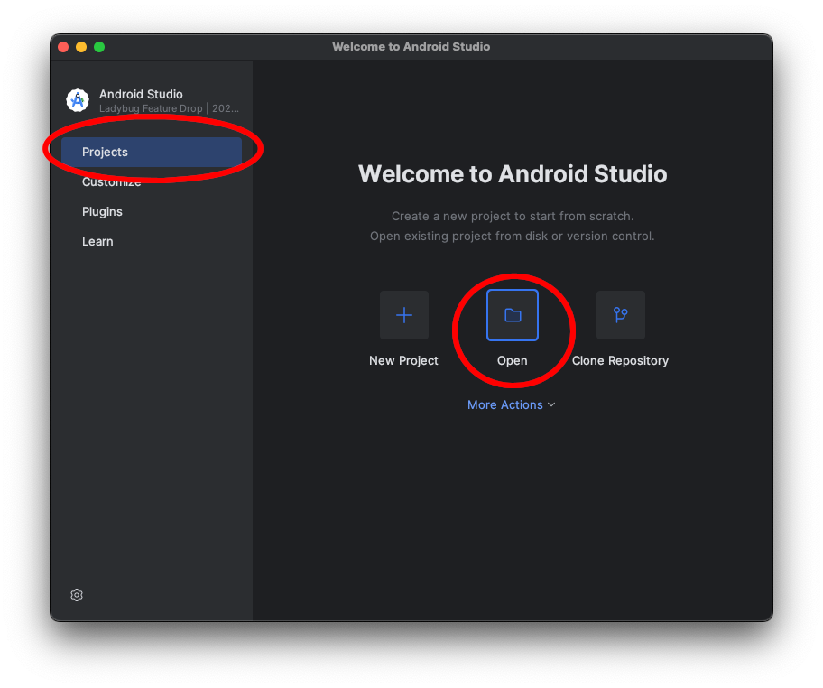
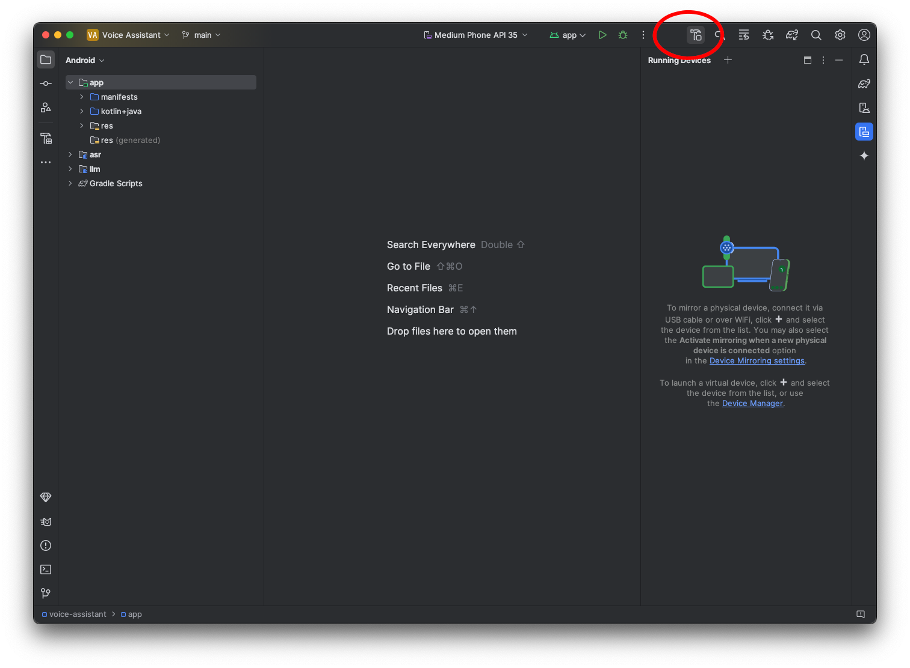
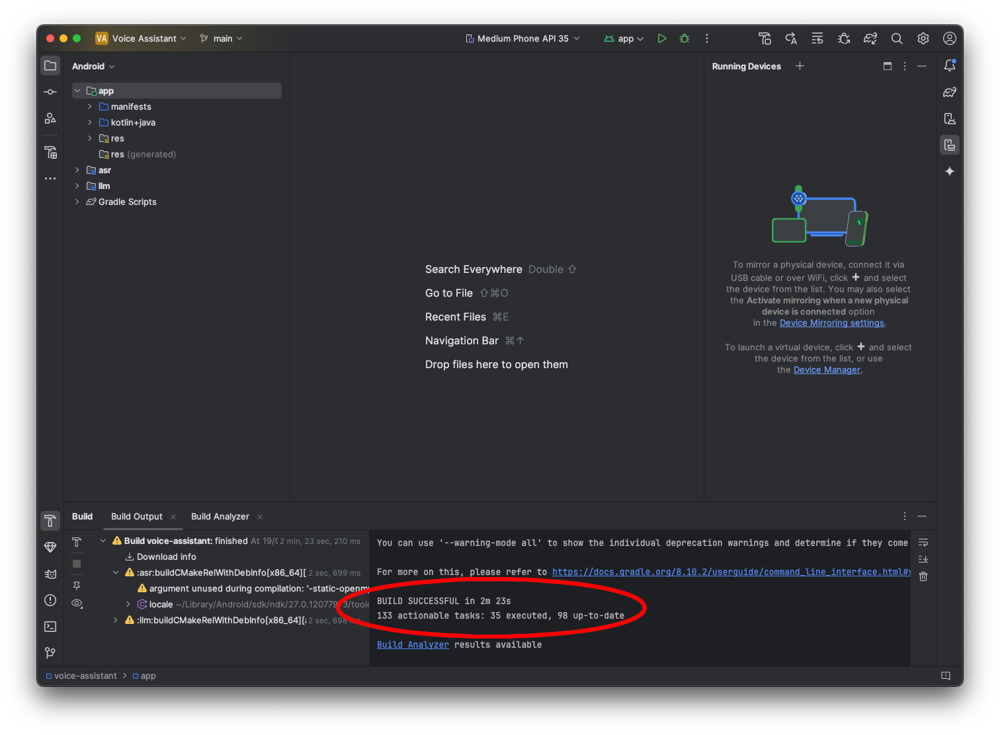

## Download the Voice Assistant

```BASH
git clone https://some/URL/voice-assistant voice-assistant.git
```

## Build the Voice Assistant

Open Android Studio and open the project that you have just download in the
preceding step:



Build the application with its default settings by clicking the little hammer
"Make Module 'VoiceAssistant.app'" button in the upper right corner:



Android studio will start the build which may take some time if it has to
download some dependencies of the Voice Assistant app:


