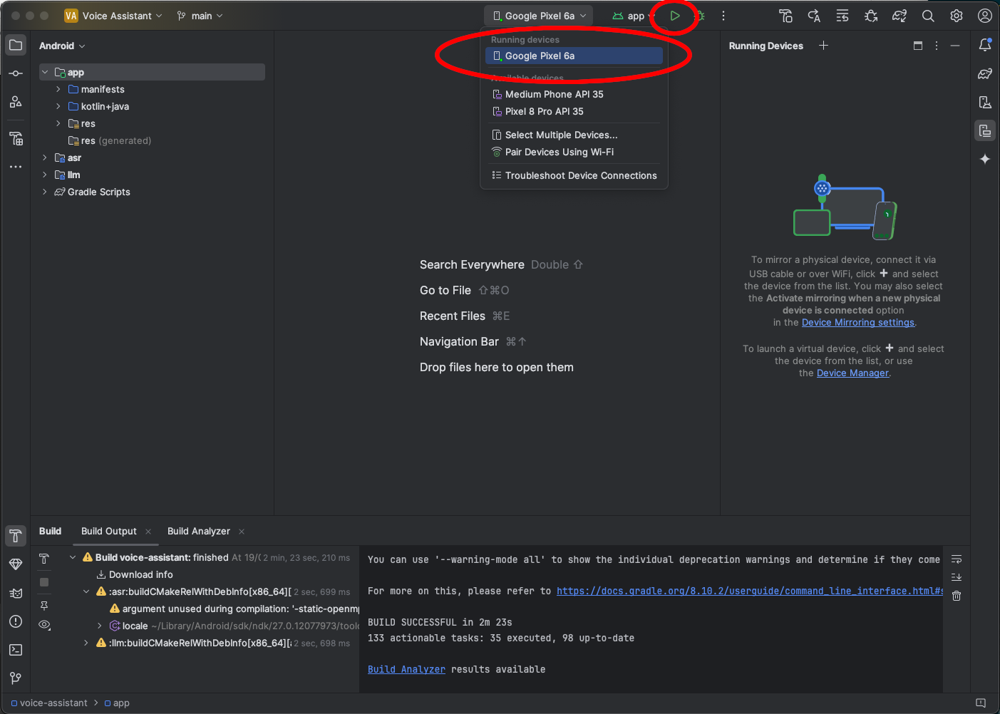
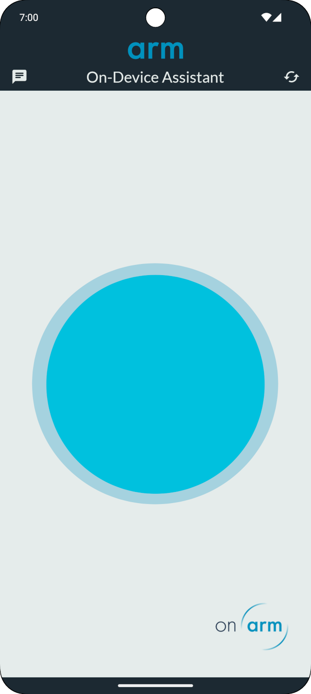
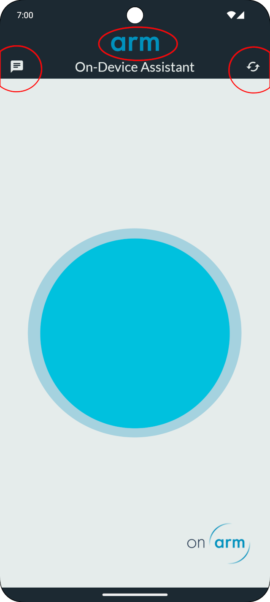
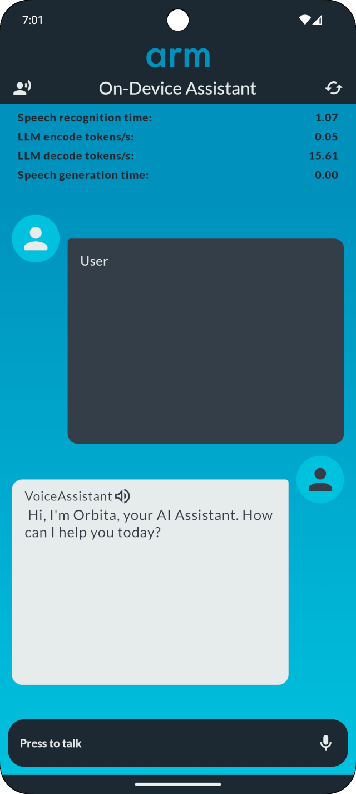
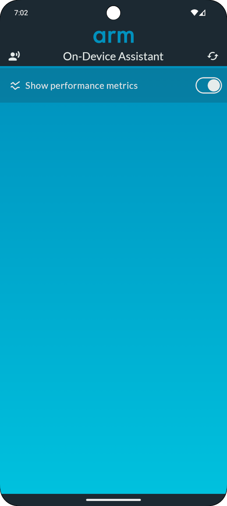

In the previous section, we have build the Voice Assistant app. We now need to install it on the phone. The easiest way to achieve this is to put the Android phone in developer mode and use an USB cable to upload the application.

## Switch your phone to developer mode

By default, the developer mode is not active on Android phones. You will need to activate it by following [these instructions] (https://developer.android.com/studio/debug/dev-options).

## Upload the Voice Assistant to your phone

Once your phone is in developer mode, plug it to the USB cable: it should appear as a running device in the top bar. Select it and then press the run button (small red circle in figure 4 below). This will transfer the app to the phone and launch it.

In the picture below, a Pixel 6a phone has been connected to the USB cable:

## Run the voice assistant

The Voice assistant will welcome you with this screen:

You can now press the big blue button in the center and ask your request !

## Alternate view and settings

You can change the view or the apps settings by clicking on one of the three elements circled in red:

By clicking on the icon in the upper right corner, you can reset the assistant's context. By clicking on the upper left icon, you get a different view of the assistant with the text that it understood and spoke to you (see figure 7). Clicking on the Arm logo at the top center will enable you to configure the Voice Assistant (see figure 8).

