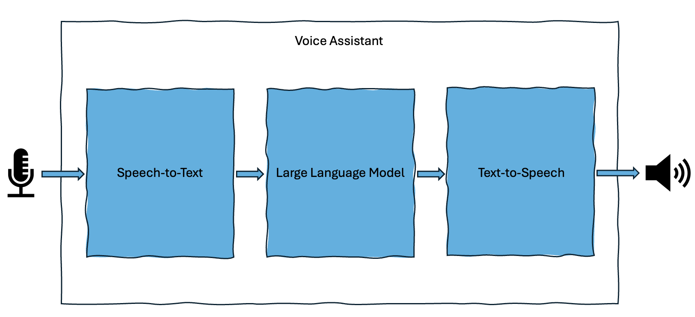

The Voice Assistant is an example application which demonstrates a complete
voice interaction pipeline for Android.

It generates intelligent responses by utilizing :
1. Speech-to-Text (STT) to transform user's audio prompt into a text representation,
2. a Large Language Models (LLM) to answer the user's prompt in a text representation,
3. Android Text-to-Speech (TTS) API is then used to produce back a voice response.

Those 3 steps actually corresponds to specific components used in the Voice
Assistant application. A more detailed description of each one of them follows.

## Speech to Text Library

Speech-to-Text is also known as Automatic Speech Recognition. This part of the
pipeline focuses on converting spoken language into written text.

Speech recognition is done in the following stages:
- the device's microphone captures spoken language as an audio waveform,
- the audio waveform is broken into small time frames, features are extracted
  from it to represent sound,
- a neural network is used to predict the most likely transcription of audio
  based on grammar and context,
- final recognized text is generated and used for the next stage of the
  pipeline.

## Large Language Models Library

Large Language Models (LLMs) are designed for natural language understanding,
and in this application, they are used for question-answering.

The text transcription from previous part of the pipeline is used as an input to
the neural model. During initialization, the application assigns a persona to
the LLM to ensure a friendly and informative voice assistant experience. By
default, the application uses asynchronous flow for this part of the pipeline,
meaning that parts of response are collected as they become available. The
application UI is updated with each new token and these are also used for final
stage of the pipeline.

## Text to Speech Component

Currently, this part of the application pipeline is using Android Text-to-Speech
API with some extra functionality in the application to ensure smooth and
natural speech output.

In synchronous mode, speech is only generated after the full response from LLM
is received. By default, the application operates in asynchronous mode, where
speech synthesis starts as soon as a sufficient portion of the response (such as
a half or full sentence) is available. Any additional responses are queued for
processing by the Android Text-to-Speech engine.
