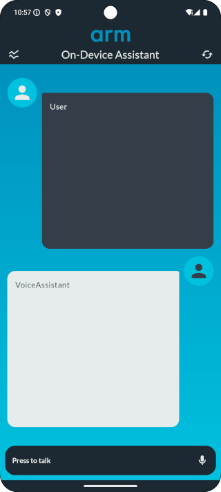
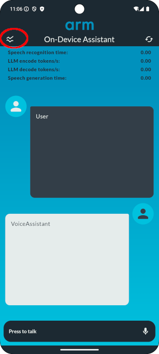

In the previous section, we have build the Voice Assistant app. We now need to
install it on the phone. The easiest way to achieve this is to put the Android
phone in developer mode and use an USB cable to upload the application.

## Switch your phone to developer mode

By default, the developer mode is not active on Android phones. You will need to
activate it by following [these instructions]
(https://developer.android.com/studio/debug/dev-options).

## Upload the Voice Assistant to your phone

Once your phone is in developer mode, plug it to the USB cable: it should appear
as a running device in the top bar. Select it and then press the run button
(small red circle in figure 4 below). This will transfer the app to the phone
and launch it.

In the picture below, a Pixel 6a phone has been connected to the USB cable:

## Run the voice assistant

The Voice assistant will welcome you with this screen:

You can now press the part at the bottom and ask your request !

## Voice assistant controls

### Performance counters

You can switch on/off the display of some performance counters like:
- Speech recognition time,
- LLM encode tokens/s,
- LLM decode tokens/s,
- Speech generation time

by clicking on the element circled in red in the upper left:

### Reset assistant's context

By clicking on the icon circled in red in the upper right corner, you can reset
the assistant's context.

